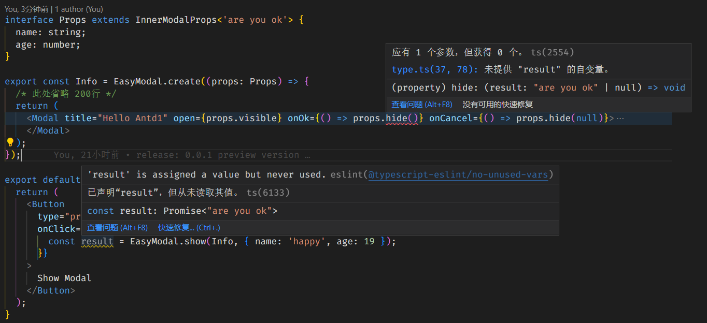

<p><h4 align='center'>ez modal react</h4></p>

​	EasyModal 的理念很简单：**将模态框视为异步事件，通过 Promise 管理其生命周期**，减少繁琐的状态管理，让打开、更新和关闭操作就像撰写 `async` 函数一样自然，并且提供类型推导和约束。

<p align='center'>简体中文 | <a href='./README.md'>English</a> </p>

[](https://www.npmjs.com/package/ez-modal-react) [](https://www.npmjs.com/package/ez-modal-react) [](https://github.com/raotaohub/ez-modal-react/blob/main/LICENSE)

## ✨ 特性

1. 基于 **Promise** 封装，灵活易用可减少繁琐的状态管理。
2. \>=React 16.8，支持 <a href="#typeinfer" title="使用返回值类型推导">返回值类型推导</a>，和类型校验。
3. 体积小(~1kb gzip)、易接入、无入侵性、支持任意 UI 库。

## 🔨 效果

集成了类型约束与推导、boolean状态、与控制方法。



## 📦 安装

```shell
# with yarn
yarn add ez-modal-react -S

# or with npm
npm install ez-modal-react -S
```

## 🚀 使用方式

1. **引入 EasyModal 使用 Provider**

```tsx
import EasyModal from 'ez-modal-react';

ReactDOM.render(
    <EasyModal.Provider> // 包裹应用
      <YourApp />
    </EasyModal.Provider>
  document.getElementById('root'),
);
```

2. **创建弹窗组件**

```tsx
import EasyModal from 'ez-modal-react';

const InfoModal = EazyModal.create((props) => (
  <Modal open={props.visible} onOk={props.hide} onCancel={props.hide}>{props.name}</Modal>
));

export default InfoModal;
```

3. **在任何地方使用**

- 调用 EasyModal.show，传入创建好的组件，打开弹窗

```tsx
import EasyModal from 'ez-modal-react';
import InfoModal from './InfoModal';

const res = await EasyModal.show(InfoModal, { name: 'foo' });
```


这就是 EasyModal 的核心功能。它减少繁琐的状态管理。

---

## ☀️ 更多

1.  <a name="typeinfer" id="typeinfer">在tsx中使用返回值类型推导</a>

- 组件使用的 props 类型需要继承 **InnerModalProps**,确保正确的推导。

```diff
import EasyModal, { InnerModalProps } from 'ez-modal-react';

+ interface IProps extends InnerModalProps<'modal'> /*传入返回值类型*/ {
+   age: number;
+   name: string;
+ }

export const InfoModal = EasyModal.create(
+ (props: Props) => {
  return (
    <Modal
      title="Hello"
      open={props.visible}
      onOk={() => {
+       props.hide(); // warn 应有 1 个参数，但获得 0 个。 (property) hide: (result: "modal") => void ts(2554)
      }}
      onCancel={() => {
+       props.hide(null); //safe hide 接受 null 作为参数，以跳过类型检查。
      }}
    >
      <h1>{props.age}</h1>
    </Modal>
  );
});

+ // 组件的 props 类型获得了约束
+ // warn 类型 "{ name: string; }" 中缺少属性 "age"，但类型 "ModalProps<Props, "modal">" 中需要该属性。
EasyModal.show(InfoModal, { name: 'foo' }).then((resolve) => {
+  console.log(resolve); // 一切正常将推导出类型 "modal"
});
```

2. <a name="使用hook" id="usehook">使用 hook - useModal</a>

- 如需获得 ts 推导需要给 `useModal`方法传入泛型参数

```diff
import EasyModal, { useModal, InnerModalProps } from 'ez-modal-react';

+ interface IProps extends InnerModalProps<'modal'>/* 指定返回值类型 */ {
+   age: number;
+   name: string;
+ }

export const Info = EasyModal.create((props: Props) => {
+  const modal = useModal<IProps/*传入当前组件props的类型 可以获得 类型推导*/>();

+  // 返回值类型获得了约束
+  modal.hide(); // 应有 1 个参数，但获得 0 个。ts(2554) (property) hide: (result: "modal") => void ts(2554)

  return <Modal open={modal.visible} /*...*/>/*...*/</Modal>;
});
```

3. <a name="config" id="config">配置默认行为</a>

> EasyModal hide 方法调用时的默认行为：
>
> 1.  调用hide时，默认同时调用 resolve 并传入参数。

> 为什么这么做？
>
> 通常，当你希望一个组件隐藏时，则视为操作结束，对应的。完全可以通过 resolve(false) 实现。

- 改变默认行为的方式：在 open 方法传入第 3 个参数

```diff
EasyModal.open(Component, {},
+  config:{
-    resolveOnHide:false, // WARN 不再受支持
+    removeOnHide:false,
+  }
);
```

4. 打开多个相同组件

使用EasyModal.create会返回一个高阶组件，这样在调用update、show、hide、remove方法的时候可以直接传入该高阶组件，而不需要知道它的id。这样无论如何调用该高阶组件始终都指向的是同一个。

```tsx
const YourComp = EasyModal.create(Component)
EasyModal.show(YourComp, props);  // 打开一个组件
EasyModal.show(YourComp, props);  // 并不会再打开一个组件
EasyModal.show(YourComp, props);  // 并不会再打开一个组件

!此时页面上只有1个弹窗

EasyModal.update(YourComp, willUpdateProps); // 更新时也始终指向同一个
```

如果不使用EasyModal.create创建高阶组件，那么可以使用一个普通组件，则可以同时打开多个相同组件

```tsx
const YourComp0 = EasyModal.show(Component, props, 											 ); // 打开一个组件
const YourComp1 = EasyModal.show(Component, props, {id: 'i am customId1'}); // 再打开一个组件
const YourComp2 = EasyModal.show(Component, props, {id: 'i am customId2'}); // 再再打开一个组件

!此时页面上有3个弹窗

																										 // YourComp0 无法更新，并且会在关闭后被移除
EasyModal.update('i am customId1', willUpdateProps); // 可以使用自定义 id 来更新 YourComp1
EasyModal.update('i am customId2', willUpdateProps); // 可以使用自定义 id 来更新 YourComp2

EasyModal.update('i am customId1', willUpdateProps); // 可以使用自定义 id 来更新 YourComp1
EasyModal.update('i am customId2', willUpdateProps); // 可以使用自定义 id 来更新 YourComp2
```


## 📚 API

#### 组件

| 属性               | 说明                       | 类型     |
| ------------------ | -------------------------- | -------- |
| EasyModal.Provider | Provider组件，包裹整个应用 | React.FC |

#### 方法


```ts
type IdOrComp = EasyModalHOC|string|number

type ItemConfig = {
  resolveOnHide?: boolean;
  id?: CustomId;
};
```


| 方法             | 说明                                                         | 类型                                                         |
| ---------------- | ------------------------------------------------------------ | ------------------------------------------------------------ |
| EasyModal.create | 创建一个唯一的 EasyModalHOC 组件                             | (Comp:React.Component) => EasyModalHOC                       |
| EasyModal.show   | 打开一个EasyModal.create创建的EasyModalHOC（single的）、或普通组件但可重复（mult的） | (EasyModalHOC\|React.Component,props:**P**,config: ItemConfig) => Promise<T\> |
| EasyModal.update | 更新一个EasyModalHOC组件                                     | (id:IdOrComp,props:any) => void                              |
| EasyModal.hide   | 隐藏一个组件                                                 | (id:IdOrComp,result?: **R** \| null ) => void                |
| EasyModal.remove | 移除一个组件(从dom中删去)                                    | (id:IdOrComp) => void                                        |
| useModal         | 在被show调用的组件中使用，返回该控制器相关的属性，如下【属性】 | () =>  InnerModalProps & **P**                               |

#### 注入属性

使用EasyModal.open打开的组件会被包装成一个EasyModalHOC高阶组件，内部会在props中注入额外的属性。

| 属性 | 说明 | 类型 |
| --- | --- | --- |
| visible | 是否显示。 | boolean |
| hide | 关闭。默认将参数传递给resolve方法并调用。 | (result?:  T \| null ) => void |
| remove | 否移除当前组件。 | () => void |
| resolve | resolve方法，参数作为返回值传递给EasyModal.show(); | (result?:  T ) => void |
| reject | promise的reject方法 | () => void |
| config | 当前高阶组件的的配置 | {removeOnHide: boolean; resolveOnHide: boolean; id: string} |
| ...props | 由用户传入给组件的props | **P** |

- 关于上述表格中的泛型`P`和`R`是指，是由使用者指定的组件的 `props:P` 的及`EasyModal.show()` =>Promise <P>的类型 。

  ```diff
  + interface IProps extends InnerModalProps<'modal'>/* R */ {
      /* P */
  +   age: number;
  +   name: string;
  + }
  ```
- 关于 useModal 和 注入的 props 区别。

> 1. 在组件内部得到的 **props** 和 **useModal()** 返回值 **具有相同的属性和方> 法**。
>
> 2. **useModal()** 返回值的`hide` `resolve`方法 ，和大多数 hook 一样默认不具备类型推导。你必须显式给 useModal<T> 方法传入当前组件的 props 类型。
>
>    > btw 这正是我做这个项目的原因，我喜欢直接使用 props。

<a href="#usehook" title="使用 hook">使用 hook</a>


## 🎮 Codesandbox Demo

[Demo Link](https://codesandbox.io/p/sandbox/confident-shape-rt7bzr?embed=1)

## ⭐ 灵感来源

1. fhd @xpf
2. [nice-modal-react](https://github.com/eBay/nice-modal-react)

## 🙏 鸣谢

感谢[SevenOutman (Doma)](https://github.com/SevenOutman) 仓库搭建的支持, 我借鉴与参考了他的 [aplayer-react](https://github.com/SevenOutman/aplayer-react) 项目。

## ⌨️ 其他

[Issues](https://github.com/raotaohub/ez-modal-react/issues)

## LICENSE

[MIT](https://github.com/raotaohub/ez-modal-react/blob/main/LICENSE)

---
